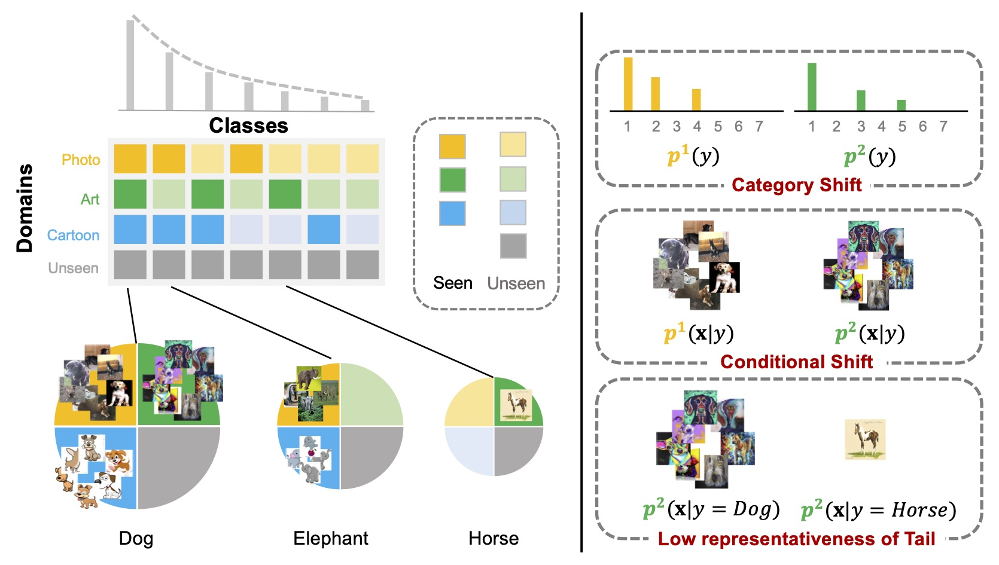

# LT-DS
[ECCV 2022] Repo for our paper "Tackling Long-Tailed Category Distribution Under Domain Shifts" 

[[project](https://xiaogu.site/LTDS)] [[dataset](./dataset/)]

<p align="center"></p>


## Dataset 
We provided two datasets for benchmarking LT-DS problems. 
Due to the license issue, we only provided instructions on how to create the corresponding datasets. 
Please follow [here](./dataset/).


## Training 
### AWA2-LTS
```commandline
python train/trainer.py --cfg config/exp/awa2.yaml 
```

### ImageNet-LTS
```commandline
python train/trainer.py --cfg config/exp/imagenet.yaml
```


## TODO
- [ ] Add evaluation scripts
- [ ] Add requirements
- [ ] Add PACS-ODG experiments
- [ ] Add Imbalanced Baselines


## Citation
If you find our paper useful, please consider citing:
```bibtex
@inproceedings{gu2022tackling,
  title={Tackling Long-Tailed Category Distribution Under Domain Shifts},
  author={Gu, Xiao and Guo, Yao and Li, Zeju and Qiu, Jianing and Dou, Qi and Liu, Yuxuan and Lo, Benny and Yang, Guang-Zhong},
  booktitle={ECCV},
  year={2022}
```

## Acknowledgement
Our codes are inspired from the following repos:
[OpenDG-DAML](https://github.com/thuml/OpenDG-DAML)[BagofTricks-LT
](https://github.com/zhangyongshun/BagofTricks-LT)[ISDA](https://github.com/blackfeather-wang/ISDA-for-Deep-Networks).