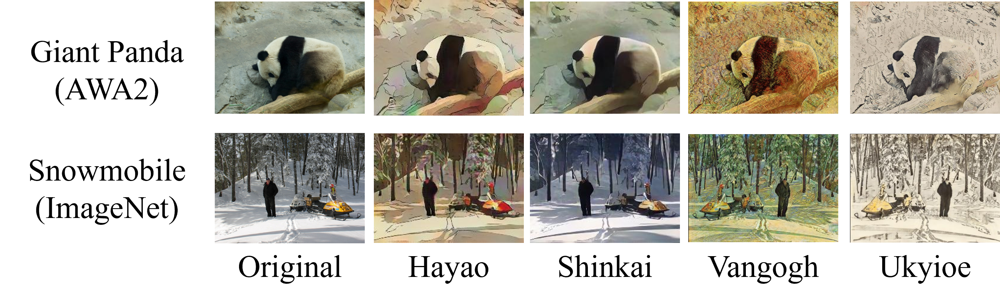

<h1>Dataset Curation for LT-DS Benchmarks</h1>

<p align="center"></p>

## Data Folder Structure
```
DATA
├── awa2-lts
│   ├── image_list
│   │   ├── Original_train.txt
│   │   ├── Original_val.txt
│   │   ├── Original_test.txt
│   │   ├── Hayao_train.txt
│   │   ...    
│   ├── embedding
│   │   ├── ...
│   ├── original
│   │   ├── antelope
│   │   │   ├── antelope_00001.jpg
│   │   │   ├── antelope_00002.jpg
│   │   │   ...
│   │   ├── bat
│   │   ├── ...
│   ├── hayao
│   │   ├── antelope
│   │   │   ├── antelope_00001_hayao.jpg
│   │   │   ├── antelope_00002_hayao.jpg
│   │   │   ...
│   │   ...
│   ├── shinkai
│   │   ├── antelope
│   │   ...
│   ├── ukiyoe
│   │   ├── antelope
│   │   ...
│   └── vangogh
│       ├── antelope
│       ...
└── imagenet-lts
    ├── image_list
    │   ├── ...
    ├── embedding
    │   ├── ...
    ├── original
    │   ├── ILSVRC2012_val_00048700.JPEG
    │   ...
    ├── hayao
    │   ├── ILSVRC2012_val_00048700_hayao.jpg    
    │   ...
    ├── shinkai
    │   ├── ...
    ├── ukiyoe
    │   ├── ...
    └── vangogh
        ├── ...
        
```

## Download the datasets
Firstly, download the original **AWA2** and **ImageNet** datasets. And put it to the `DATA/` structured as above 

* **AWA2** 
  1. Download from [here](https://cvml.ist.ac.at/AwA2/). 
  2. Put it to the `DATA/awa2/original`

* **ImageNet-LT** 
  1. Download [ImageNet_2014](http://image-net.org/index), and the [ImageNet-LT](https://drive.google.com/drive/folders/19cl6GK5B3p5CxzVBy5i4cWSmBy9-rT_-) file list. 
  2. Based on the filelist, extract images from `ImageNet_LT_train.txt`, `ImageNet_LT_test.txt`, `ImageNet_LT_val.txt`, and put them to `DATA/imagenet/original`

## Style Transfer 
We use [CartoonGAN]('https://github.com/Yijunmaverick/CartoonGAN-Test-Pytorch-Torch') for Hayao and Shinkai styles, and [CycleGAN]('https://github.com/junyanz/pytorch-CycleGAN-and-pix2pix') for Vangogh and Ukiyoe styles

Given the original sample with the name *`X.jpg`*, its corresponding style-transferred images are named as *`X_hayao.jpg`*, *`X_vangogh.jpg`*, *`X_shinkai.jpg`*, *`X_ukiyoe.jpg`*

### Steps
Change REPO with this repo path, DATA with DATA folder path


**Hayao and Sinkai**
```commandline
git clone https://github.com/Yijunmaverick/CartoonGAN-Test-Pytorch-Torch
cd CartoonGAN-Test-Pytorch-Torch
source pretrained_model/download_pth.sh
cp REPO/data/transfer_hs.py .
python transfer_hs.py --dataset awa2 --datapath DATA --style Hayao
```

**Vangogh and Ukiyoe**
```commandline
git clone https://github.com/junyanz/pytorch-CycleGAN-and-pix2pix
cd pytorch-CycleGAN-and-pix2pix
source ./scripts/download_cyclegan_model.sh style_vangogh 
source ./scripts/download_cyclegan_model.sh style_ukiyoe 
cp REPO/data/transfer_vu.py .
python transfer_vu.py --dataset imagenet --datapath DATA --style vangogh --dataroot . --name style_vangogh --model test
```


## Train/Val/Test Splits
We provide the pre-defined train/validation/test index files to benchmark related algorithms.

Download from [here](https://www.dropbox.com/sh/k58lneijxxsqri9/AABlFhp537-Nd2lJbRCYOJZUa?dl=0) and put to corresponding sub-folders under ``DATA/`` 


## Semantic Embeddings
Download the embeddings utilized in our experiments. Download from [here](https://www.dropbox.com/sh/k58lneijxxsqri9/AABlFhp537-Nd2lJbRCYOJZUa?dl=0) and put to corresponding sub-folders under ``DATA/`` 


## Acknowledgement
[CartoonGAN](https://github.com/Yijunmaverick/CartoonGAN-Test-Pytorch-Torch),
[CycleGAN](https://github.com/junyanz/pytorch-CycleGAN-and-pix2pix),
[ImageNet-LT](https://drive.google.com/drive/folders/19cl6GK5B3p5CxzVBy5i4cWSmBy9-rT_-),
[AWA2](https://cvml.ist.ac.at/AwA2/)